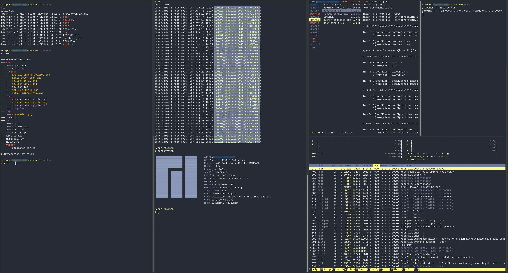

<h1 align="center">.dotfiles</h2>

Personal configuration for my Arch Linux install

  <a href="#introduction"><strong>Introduction</strong></a>
  ·
  <a href="#screenshot"><strong>Screenshot</strong></a>

  <a href="https://github.com/clintval/.dotfiles/issues">
    </img>
  </a>
  <a href="https://github.com/clintval/.dotfiles/blob/master/LICENSE">
    </img>
  </a>

  

<h3 align="center">Introduction</h3>

Contained configuration file set for my Arch Linux environment.

Toolchain:

- [dotbot](https://github.com/anishathalye/dotbot): dotfile bootstrapping utility
- [Zsh](http://www.zsh.org/): interactive shell (akin to `bash`)
- [oh-my-zsh](https://github.com/robbyrussell/oh-my-zsh): plugins and prompt for Zsh shell
- [direnv](https://direnv.net/): shell environment context switcher

 

<h3 align="center">Screenshot</h3>

